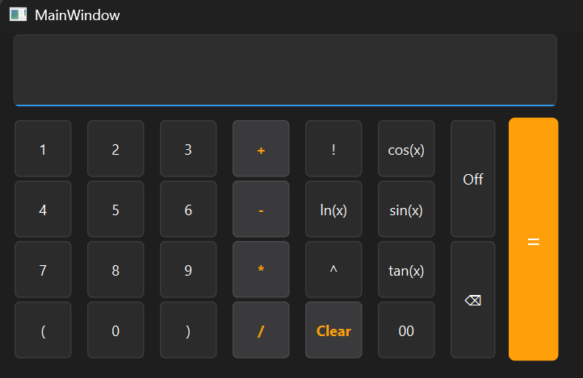

# 🧮 Basic Scientific Calculator (Written by Gemini 2.5 Pro ^v^)

A powerful desktop calculator application built with **C++** and **Qt 6 Framework**. This project implements the **Shunting Yard Algorithm** which is taught by Mr. Le Ngoc Thanh - HCMUS - VNU in Fundamental of Programming class to handle mathematical expressions with operator precedence, parentheses, and trigonometric functions.

 
## ✨ Features

* **Operands:** Just handling integers, will be upgraded later
* **Standard Operations:** Addition, Subtraction, Multiplication, Division, Power (`^`).
* **Scientific Functions:** Trigonometry (`sin`, `cos`, `tan`), Logarithm (`ln`), and Factorial (`!`).
* **Complex Expressions:** Supports nested parentheses `()` and operator precedence.
* **Modern UI:** Custom **Dark Mode** interface designed with Qt Style Sheets (QSS).
* **Keyboard Support:** Fully mapped keyboard shortcuts for fast input.

## 🛠️ Tech Stack

* **Language:** C++ (Standard Library: `stack`, `queue`, `cmath`)
* **Framework:** Qt 6 (Qt Widgets)
* **Algorithm:** Shunting Yard (Infix to Postfix conversion) - Reverse Polish Notation (RPN) evaluation.
* **Tool:** Qt Creator

## ⌨️ Keyboard Shortcuts

| Key | Action |
| :--- | :--- |
| `0-9`, `+`, `-`, `*`, `/` | Input numbers and operators |
| `Enter` / `Return` | **Calculate (=)** |
| `Esc` | Clear All (AC) |
| `Backspace` | Delete last character (DEL) |
| `^` | Power |
| `!` | Factorial |

## 🚀 How to Build & Run

1.  **Clone the repository:**
    ```bash
    git clone [https://github.com/YOUR_USERNAME/Calculator-Qt-Cpp.git](https://github.com/YOUR_USERNAME/Calculator-Qt-Cpp.git)
    ```
2.  Open `CMakeLists.txt` (or `.pro`) file in **Qt Creator**.
3.  Configure the project (Select your Kit).
4.  Build in **Release** mode for best performance.
5.  Run the application!

## 👨‍💻 Author

**Ngo Phuoc Toan** *Student at VNU-HCM, University of Science* *Major: Information Technology - 25C09*

---
